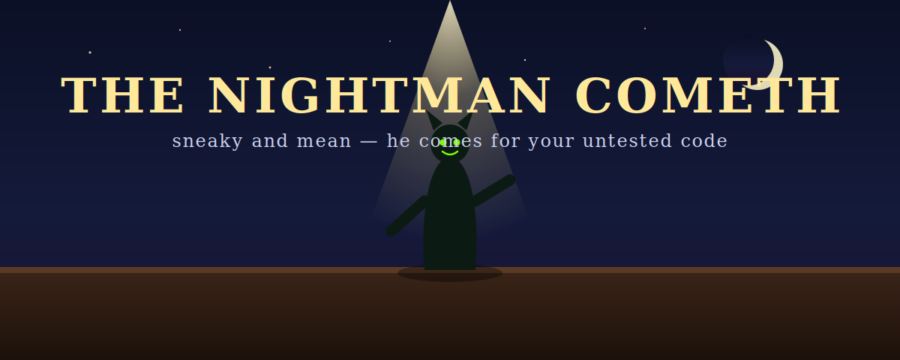

<div align="center">



# Nightman

**The Nightman comes for your untested code.**

Point it at a Python function. It throws adversarial inputs until something breaks, shrinks the failure to its smallest form, and hands you the pytest regression test that proves it. A **bug-finder, not a test-writer** — it only writes a test once it already has a crash in hand.

Ships as a **CLI** and an **MCP server**. Second in a gang of *It's Always Sunny*-flavored dev tools, after [Charlie Work](https://github.com/Falcon305/charlie-work-mcp).

</div>

---

> **🌙 THE NIGHTMAN COMETH.** *Sneaky and mean. A master of karate — and of the empty list you forgot to handle.*

The jokes are a **toggle, not a tax** — pass `--plain` (or set `NIGHTMAN_VOICE=off`) and every line comes back flavor-free, paste-into-a-ticket clean. CI and machine output are always plain.

## Why not just "AI writes my tests"?

Because auto-generated tests are distrusted for good reasons — they pin whatever the code already does, they flake, they assert nothing that matters. Nightman is the opposite by construction:

- **It leads with a real failure.** Nothing is written until a generated input actually crashes the function or violates a stated property. No crash, no test.
- **What it commits can't flake.** The deliverable is a *frozen, minimized* `pytest.param(...)` case — one pinned input, deterministic, no live fuzzer in your CI.
- **You write zero properties.** Nightman infers them from type hints, signatures, and docstrings — killing the #1 reason people bounce off property-based testing.

## Quickstart

Run it straight from the repo with [`uv`](https://docs.astral.sh/uv/) — no clone, no build:

```bash
uvx --from git+https://github.com/Falcon305/nightman nightman hunt yourmodule:your_function
```

Or point it at a file directly:

```bash
uvx --from git+https://github.com/Falcon305/nightman nightman hunt path/to/parsing.py:parse
```

## What it looks like

```
$ nightman hunt binsearch.py:search

🌙 THE NIGHTMAN COMETH.
   He came for search() with:  search(arr=[], target=0)
   → IndexError: list index out of range at binsearch.py:5
   found on try #1.
   shrunk to its smallest form in 310 more.
```

`nightman harden binsearch.py:search --write` does the same, then drops a committable regression test:

```python
# Regression test written by Nightman (github.com/Falcon305/nightman).
# The Nightman came for search() and it broke:
#   search(arr=[], target=0)
#   -> IndexError: list index out of range
# The minimized failing input is pinned below. Delete this test once the bug is dead.
import pytest

from binsearch import search


@pytest.mark.parametrize("kwargs", [pytest.param({'arr': [], 'target': 0}, id='nightman-3821a3')])
def test_search_nightman(kwargs):
    search(**kwargs)
```

That test **fails on the buggy code and passes once you fix it** — a real regression net, not a snapshot of today's behavior.

## How it works (delegate, don't reinvent)

Nightman's value is the orchestration, the sandbox, and the committable artifact — not a new fuzzer. Under the hood it stands on the best open engines:

- **Generation + shrinking → [Hypothesis](https://hypothesis.readthedocs.io/).** Its shrinking engine is world-class; Nightman drives it and captures the minimized counterexample.
- **Strategy inference** from type hints (`from_type`/`builds`), with a fallback ladder for untyped code: docstring types → default values → parameter-name heuristics → a hand-built **chaos corpus** (empty collections, `NaN`/±inf, boundary ints, surrogate/`\x00`/huge strings).
- **Properties**, strongest-first: a *never-crashes* floor, plus `roundtrip` (`decode(encode(x)) == x`, detected by name pairs), `idempotence`, and a **differential** oracle for comparing a suspect against a reference.
- **A sandboxed executor** — each hunt runs in a spawned subprocess with CPU/memory limits, so a memory bomb or an infinite loop is capped, and a native **segfault survives as a reported result instead of taking down the run**.

## Proving it works — the eval

Novelty isn't the moat (Anthropic and AWS have both shown agents can do this); a *trustworthy, packaged* tool is. So Nightman ships a reproducible eval over a corpus of **planted bugs** — off-by-one, empty-input, unicode, unsafe `eval`, integer truncation, runaway recursion, and more. For each it measures detection, repro minimality, and time-to-first-failure — and critically, **runs the same hunt against the *fixed* code and requires zero false positives**. (Scorecard lands with v0.1 as the eval is finalized.)

## Status

**v0.1, in progress.** The engine — infer → hunt → shrink → sandbox → emit — works today via the CLI. Landing next: the finalized eval scorecard, the MCP server (`nightman serve`, with `hunt`/`shrink`/`harden` tools), and production polish (typed, CI across 3.11–3.13, PyPI). Follow along; it's pushed as it's built.

## The gang

Each ships as its own standalone tool: **[Charlie Work](https://github.com/Falcon305/charlie-work-mcp)** (the toil nobody wants to do) · **Nightman** (the input your code wasn't ready for) · more coming.

## License

Code: MIT.

The hero is an original illustration. A still from *It's Always Sunny in Philadelphia*'s "The Nightman Cometh" (© FX Networks) may be dropped at `assets/nightman-cometh.jpg` for identification and commentary; it would not be covered by the MIT license and remains the property of its rights holder.
